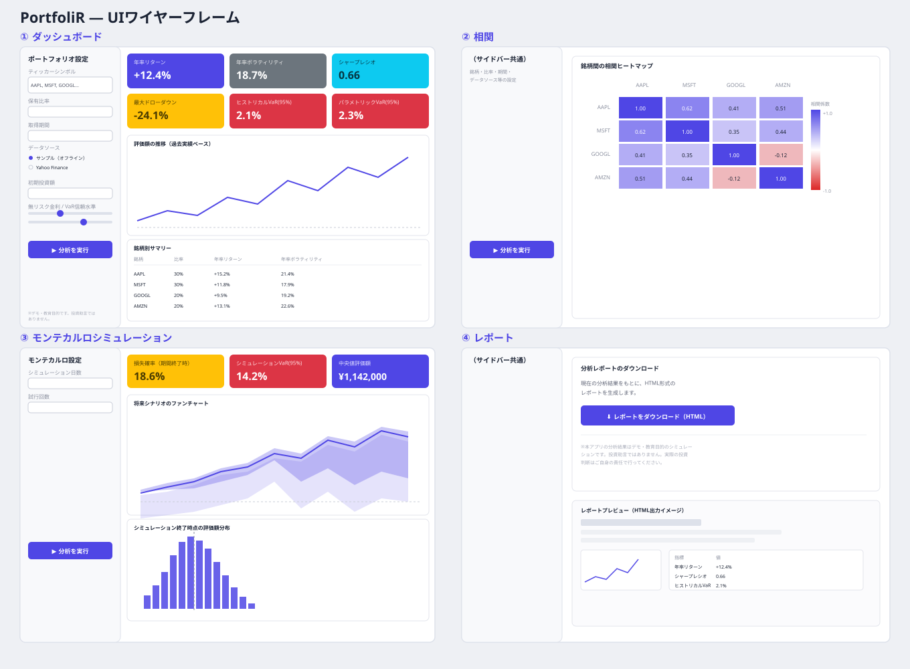
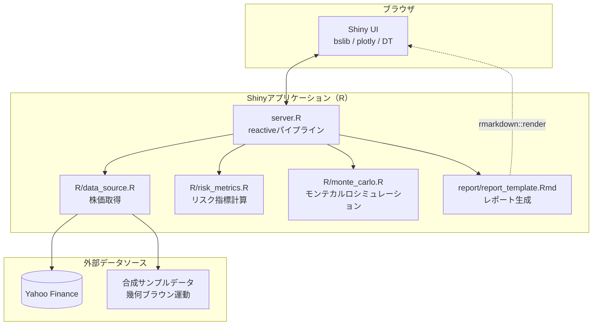
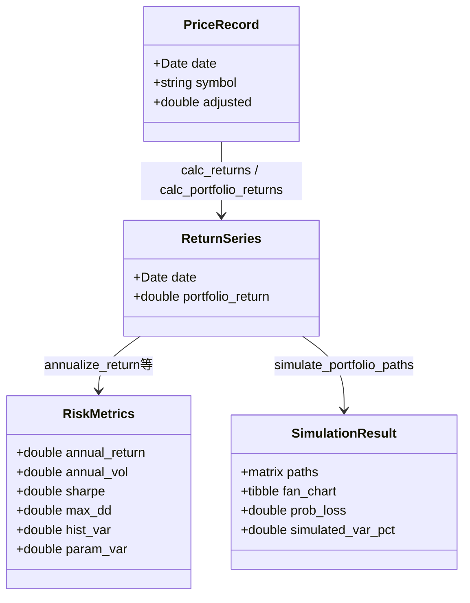

# PortfoliR

 

**Portfolio × R** — 保有資産のリスクをシミュレーションで可視化する、R Shiny製のポートフォリオ・リスク分析ダッシュボード。

## 概要

複数銘柄を組み合わせたポートフォリオについて、過去データに基づくリスク指標（リターン・ボラティリティ・シャープレシオ・最大ドローダウン・VaR）を計算し、さらにモンテカルロシミュレーションで将来の評価額の分布を可視化するWebアプリです。ワンクリックでHTML形式の分析レポートを出力できます。

Rの統計・データ分析の強みを活かし、リスク指標の計算式やモンテカルロシミュレーションのロジックをすべて自前で実装しています（既存パッケージのブラックボックスに頼らない設計）。

## 特徴

- **ポートフォリオ入力**: ティッカーシンボルと保有比率をカンマ区切りで入力するだけで分析対象を設定
- **リスク指標**: 年率リターン、年率ボラティリティ、シャープレシオ、最大ドローダウン、VaR（ヒストリカル法・パラメトリック法の2種類）を算出
- **相関ヒートマップ**: 銘柄間の相関係数をインタラクティブなヒートマップで表示し、分散投資の効果を確認できる
- **モンテカルロシミュレーション**: 資産間の相関を保ったまま将来の日次リターンをシミュレーションし、評価額のファンチャート（5%〜95%区間）と損失確率を算出
- **データソースの切り替え**: Yahoo Financeからの実データ取得と、オフラインで完結する合成サンプルデータ生成を切り替え可能（通信環境に依存せずデモを安定して実行できる）
- **レポート出力**: 分析結果をワンクリックでHTML形式のレポートとしてダウンロード

## ペルソナ

- 資産運用を始めたばかりで、自分のポートフォリオのリスクを定量的に把握したい個人投資家
- 「このポートフォリオはどれくらい危険なのか」を数値とグラフで説明したい学生・初学者
- Rでのデータ分析・統計処理の実践例を探しているエンジニア

## UIイメージ



サイドバーで銘柄・比率・期間・データソースなどを設定し、右側のタブ（ダッシュボード／相関／モンテカルロシミュレーション／レポート）で分析結果を切り替えて確認します。

## 技術スタック

| レイヤー | 技術 |
| --- | --- |
| アプリフレームワーク | R, Shiny |
| UI | bslib（Bootstrap 5）, plotly, DT |
| データ取得 | quantmod（Yahoo Finance） |
| データ処理 | dplyr, tidyr, tibble |
| グラフ | ggplot2 + plotly |
| レポート生成 | rmarkdown, knitr |
| テスト | testthat |
| CI/CD | GitHub Actions | pushのたびに`testthat`によるユニットテストを自動実行し、テストが通ることを継続的に検証 |

Rを選んだ理由は、金融時系列データの扱いやすさと、`chol()`（コレスキー分解）・`quantile()`・`cor()`などリスク計算に直結する統計関数が標準搭載されている点にあります。モンテカルロシミュレーションのような数値計算主体の処理を、追加のライブラリなしで簡潔に書けるのはRならではの強みです。

## システム構成図



## データモデル図



すべて分析セッション中のメモリ上に保持され、永続化ストレージは使用していません（ダッシュボードとしての利用に閉じているため）。

## セットアップ

### 前提条件

- R 4.1 以降（ネイティブパイプ `|>` を使用）
- RStudio（推奨。なくても `Rscript` から起動可能）

### 手順

1. このリポジトリをダウンロード・展開する
2. Rのコンソール（またはRStudio）でプロジェクトフォルダに移動し、依存パッケージをインストールする

   ```r
   source("install_packages.R")
   ```

3. アプリを起動する

   ```r
   shiny::runApp(".")
   ```

   または、RStudioで `ui.R` か `server.R` を開いて「Run App」ボタンを押してください。

4. ブラウザが自動的に開き、アプリが表示されます。初期状態は通信不要のサンプルデータになっているので、そのまま「分析を実行」を押せばすぐに結果を確認できます。

### テストの実行

```r
source("run_tests.R")
```

または

```
Rscript run_tests.R
```

### 開発環境についての補足

このアプリはサンドボックス環境（ネットワーク制限によりCRANへのアクセスがブロックされており、Rのインストール自体ができない環境）で開発したため、実行確認はコードレビューと括弧バランス等の静的チェックにとどまっています。実際の実行・デバッグはお手元のR環境でお願いします。エラーが出た場合は、エラーメッセージを教えていただければ修正します。

## 今後の展望

- 複数ポートフォリオの比較機能
- 効率的フロンティア（リスク・リターンの最適配分曲線）の可視化
- 為替レートを考慮した外貨建て資産のサポート
- shinyapps.ioへのデプロイとURL共有機能
